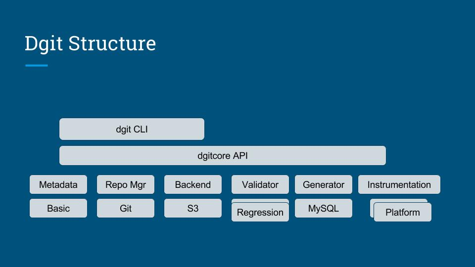

Code
====

Repo Manager
------------

dgit supports multiple ways to store datasets. It could be git itself,
local filesystem (possibly, with s3 backend). We expect to support
Instabase in future .

.. autoclass:: dgitcore.plugins.repomanager.RepoManagerBase 
    :members: 
    :undoc-members: 
    :show-inheritance:

.. autoclass:: dgitcore.contrib.repomanagers.gitmanager.GitRepoManager
    :members: 
    :undoc-members: 
    :show-inheritance:

Backends
--------

dgit is designed to support multiple backends. Intially local
filesystem and s3 are supported. We plan to support more in future.

.. autoclass:: dgitcore.plugins.backend.BackendBase
    :members: 
    :undoc-members: 
    :show-inheritance:

.. autoclass:: dgitcore.contrib.backends.s3.S3Backend
    :members: 
    :undoc-members: 
    :show-inheritance:

.. autoclass:: dgitcore.contrib.backends.local.LocalBackend
    :members: 
    :undoc-members: 
    :show-inheritance:

Instrumentation
---------------

Various plugins that can be used to instrument any process of
generation of the dataset.

.. autoclass:: dgitcore.plugins.instrumentation.InstrumentationBase 
    :members: 
    :undoc-members: 
    :show-inheritance:

.. autoclass:: dgitcore.contrib.instrumentations.content.ContentInstrumentation
    :members: 
    :undoc-members: update
    :show-inheritance:

.. autoclass:: dgitcore.contrib.instrumentations.platform.PlatformInstrumentation
    :members: 
    :undoc-members: update
    :show-inheritance:

.. autoclass:: dgitcore.contrib.instrumentations.executable.ExecutableInstrumentation
    :members: 
    :undoc-members: update
    :show-inheritance:

Metadata
--------

dgit supports posting metadata to simple API servers to enable search,
lineage computation, and sharing. A minimal posting client is
supported for now.

.. autoclass:: dgitcore.plugins.metadata.MetadataBase 
    :members: 
    :undoc-members: 
    :show-inheritance:

.. autoclass:: dgitcore.contrib.metadata.default.BasicMetadata
    :members: 
    :undoc-members: 
    :show-inheritance:

Validation
----------

.. autoclass:: dgitcore.plugins.validator.ValidatorBase 
    :members: 
    :undoc-members: 
    :show-inheritance:

.. autoclass:: dgitcore.contrib.validators.metadata_validator.MetadataValidator
    :members: 
    :undoc-members: 
    :show-inheritance:

.. autoclass:: dgitcore.contrib.validators.regression_quality.RegressionQualityValidator
    :members: 
    :undoc-members: 
    :show-inheritance:

Transformer
---------

.. autoclass:: dgitcore.plugins.transformer.TransformerBase 
    :members: 
    :undoc-members: 
    :show-inheritance:

